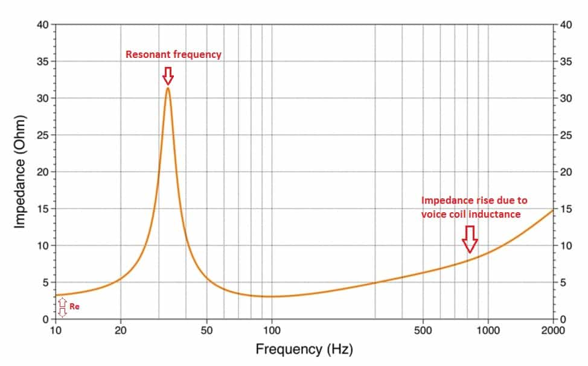
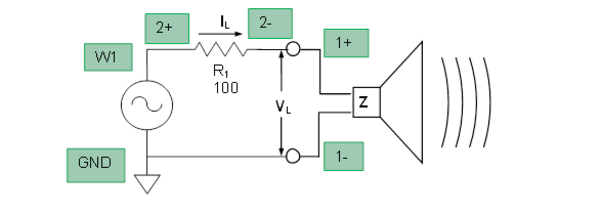

# How to measure speaker impedance

## Quick way
Use LCR to measure impedance at 100Hz, 1kHz, and 10kHz. You want absolute magnitude |Z|. Pick the smallest value. Add 15% tolerance. It has to be around the following values:
* 4Ω
* 6Ω
* 8Ω
* Everything above is either a measurement error or an old design (1960-70) or headphones.

An audio amplifier that can drive an XΩ speaker can also drive XΩ+ speakers.

## Longer way
You need two multimeters and a signal generator.
You want to plot an impedance magnitude chart like this. 

Taking 15-20 measurements is enough to get a high-fidelity graph.
Then you check the lowest value of Z and follow the "Quick way" section. 

Wire all the instruments like this.

Set frequency to 20Hz, and measure AC current and RMS voltage across the speaker. Increase frequency, take measurements, and repeat. 

## References

https://audiojudgement.com/speaker-impedance-curve-explained/

https://wiki.analog.com/university/courses/electronics/electronics-lab-speaker

